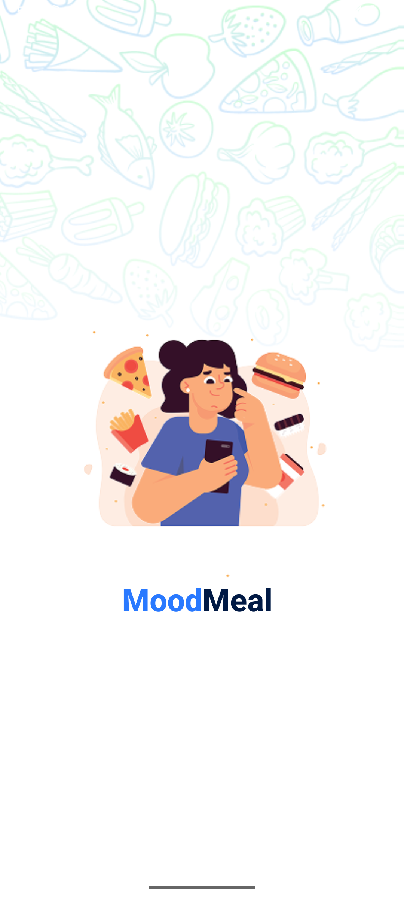
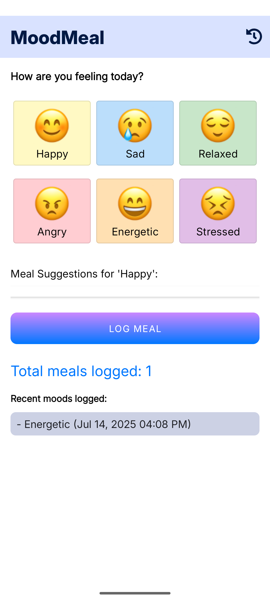
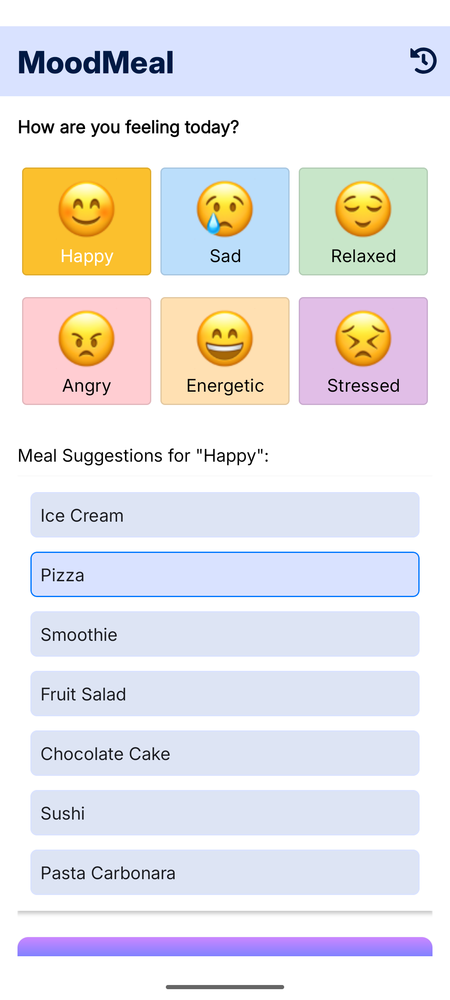
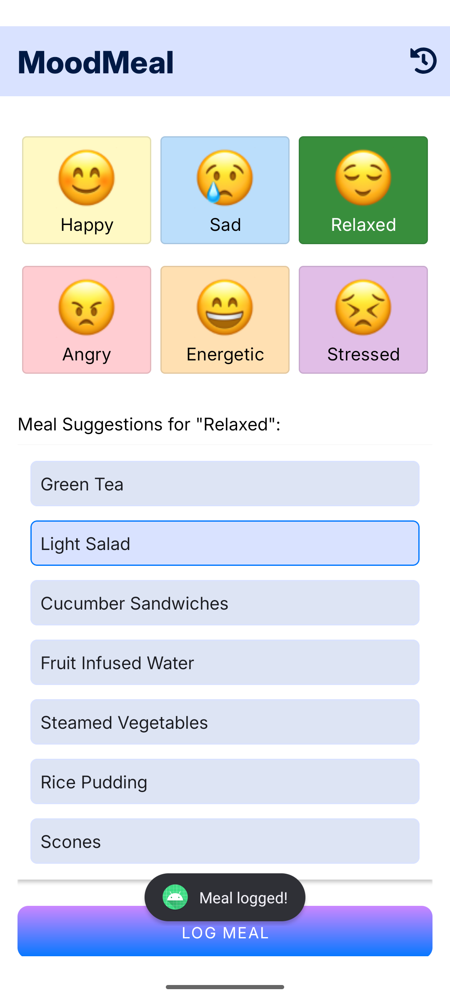
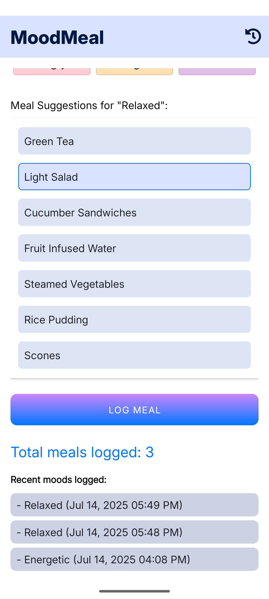
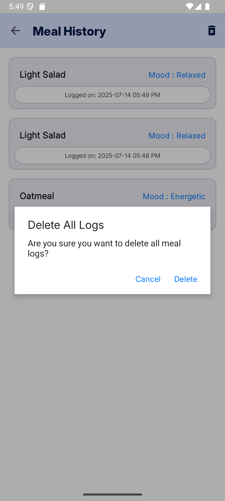


# MoodMeal
MoodMeal is a simple Android app that allows users to log their meals along with their moods.
The app helps users understand how their eating habits are connected to their emotional wellbeing.

## Key Features:
  - Log meals with mood selection
  
  - View the most recent meal even after closing the app (using SharedPreferences)
  
  - Real-time meal count and recent moods (using Firebase Realtime Database)
  
  - Full meal history (stored in Firebase Cloud Firestore)
  
  - Option to delete all logs from both Firestore and Realtime Database
  
  - Offline support with Firestore caching

## Tech Stack:
  - Android (Kotlin)
  
  - Firebase Realtime Database for live meal count and recent moods
  
  - Firebase Cloud Firestore for storing meal logs
  
  - SharedPreferences for local caching of the last meal
  
  - Firebase Firestore Caching for offline access

## Screenshot

  
  
  
  
  
  
  

